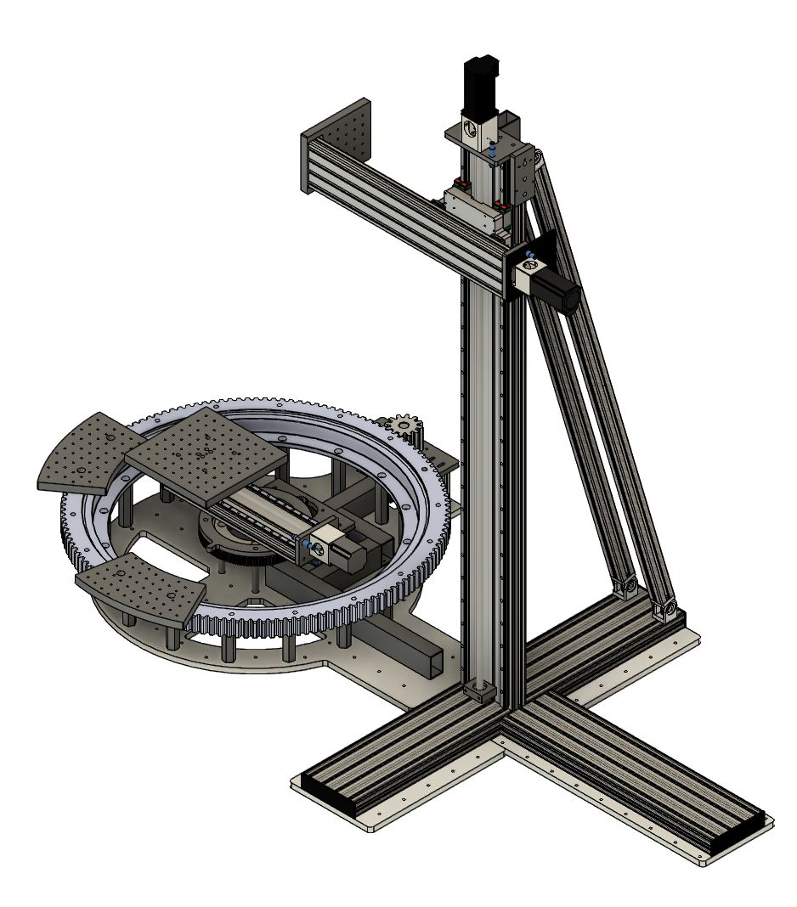
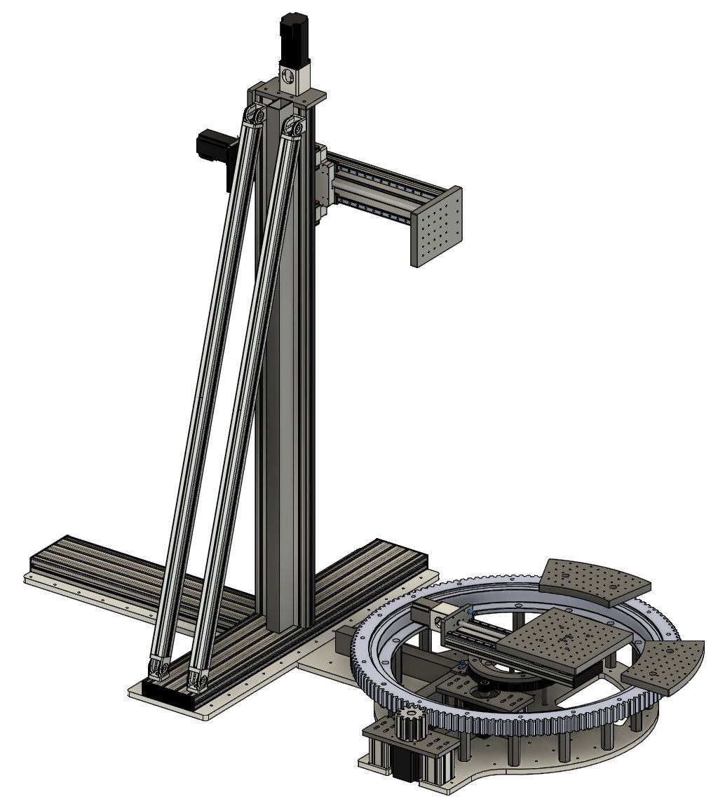

# cylindrical-positioning-system

An open source 5 axes motion system used to design antennas.

Specifications:

- 5 axes total, 3 linear, 2 rotational
- axes range:
  -  X 250mm
  -  Y 330mm
  -  Z 1170mm
  -  RX can rotate indefinitely
  -  RY ~ 720°
- OMC closed loop stepper motors 4000CP:
-  X 23HS22-2804-ME1K and CL57T
-  Y 23HS30-5004D-E1000 and CL57T
-  Z  24HS40-5004D-E1000 and CL57T
-  RX and RY 34HS31-6004D-E1000 and CL86T
- 2 x Teensy4.1 (iMXRT1062) based InMachines CNC controllers
- accuracy of linear axes: 10 microns
- accuracy of rotational axes:
  - RX ~ 0.25°
  - RY ~ 0.15°
- HiWin linear rails:
  - X and Y axes MGN12
  - Z axis HGR15
- slewing rings and spur gears:
- RX ALA838.56.1 138T  + 12T M6
- RY ASA244.25.2 120T  + 15T M2
- NSK C5 1005 and 1205 ball screws, X and Y axes
- Kamp & Kötter C5 1610 ball screw, Z Axis 
- grbl-HAL iMXRT1062 firmware
- inductive endstops on all axes
- Power Supply MeanWell RSP-750-24

Author
--

OLSK Large CNC has been designed and built by **[InMachines Ingrassia GmbH](https://www.inmachines.net/)** for  **[University of Duisburg-Essen](https://www.uni-due.de/)**.

 

Machine design:
- **[Daniele Ingrassia](https://www.linkedin.com/in/danieleingrassia/)**

Contact
--

- daniele@inmachines.net
- [https://www.inmachines.net/](https://www.inmachines.net/)

License
--

Hardware design, CAD and PCB files, BOM, settings and other technical or design files are released under the following license:

- CERN Open Hardware Licence Version 2 Weakly Reciprocal - **[CERN-OHL-W](LICENSE_CERN_OHL_W_V2.txt)**

Assembly manual, pictures, videos, presentations, description text and other type of media are released under the following license:

- Creative-Commons-Attribution-ShareAlike 4.0 International - **[CC BY-SA 4.0](LICENSE_CC_BY_SA_4.0.txt)**